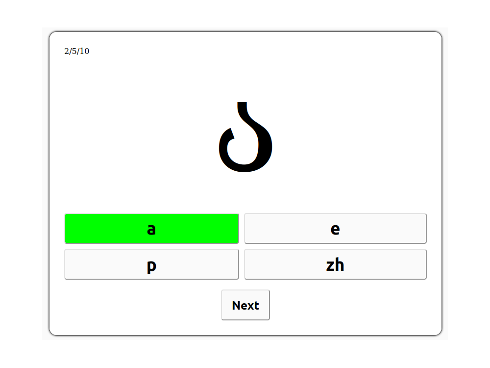

## About
This is simple JS educational project for building quizzes.

## Usage
- Create your quiz in .json format (or use default ones);
- Run API on localhost:
```
python3 server.py
```
- Then open index.html in public directory.

## Requirements
Python >= 3.7 (FastAPI, uvicorn);
NodeJS >= 18.14.2;

## Acknowledgements:
Frontend is revised version of [JavaScript-Quiz-App](https://github.com/WebDevSimplified/JavaScript-Quiz-App).
